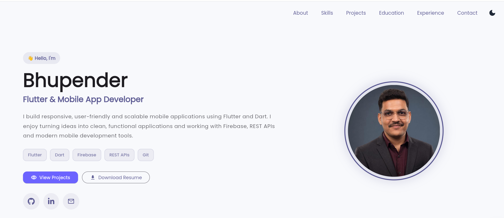
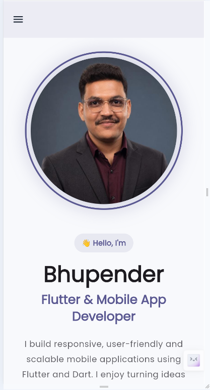
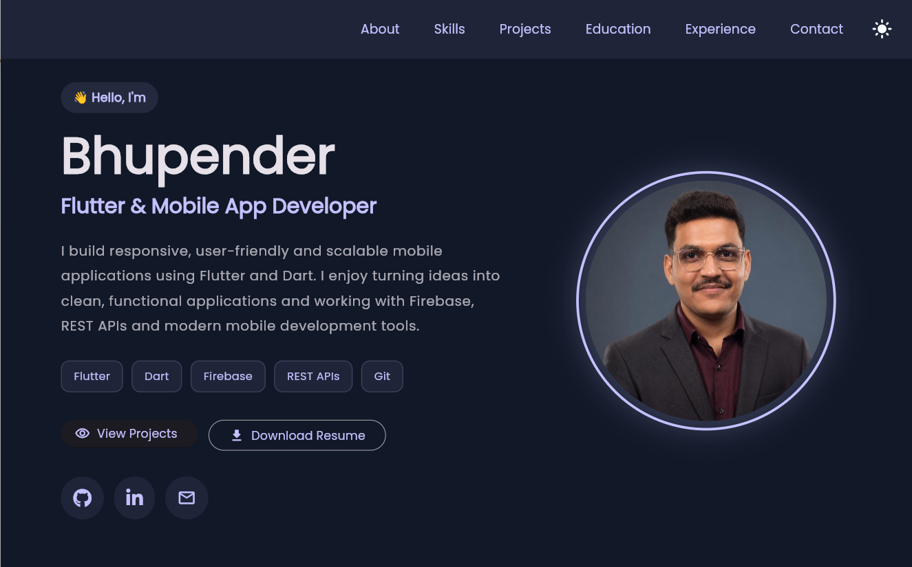

 # 💼 Bhupender's Flutter Developer Portfolio

A modern, responsive, and interactive personal portfolio website built using **Flutter Web**.

This portfolio showcases my technical skills, featured Flutter projects, educational background, practical training experience, and contact information in a clean and professional interface.

---

## 📱 Project Overview

This project is my personal **Flutter Developer Portfolio**, designed to present my skills and development work to recruiters, hiring managers, and other developers.

The portfolio is built with Flutter and provides a responsive experience across **desktop, tablet, and mobile devices**.

It includes dedicated sections for:

- About Me
- Technical Skills
- Featured Projects
- Education
- Training & Experience
- Contact Information

The portfolio also provides direct access to my GitHub, LinkedIn, live projects, source code, and downloadable resume.

---

## ✨ Features

### 🎨 Modern & Responsive UI
- Fully responsive Flutter Web design
- Optimized layouts for desktop, tablet, and mobile
- Material 3 based interface
- Clean card-based UI
- Interactive hover effects and animations

### 🌙 Light & Dark Mode
- Light theme support
- Dark theme support
- Animated theme toggle
- Theme-aware cards, text, borders, and backgrounds

### 🧭 Smooth Navigation
- Navigation between portfolio sections
- Responsive desktop navigation bar
- Mobile navigation drawer
- Smooth scrolling to selected sections
- Scroll-to-top floating action button

### 👨‍💻 Developer Introduction
- Professional developer introduction
- Flutter & Mobile App Developer profile
- Technology badges
- Profile image
- GitHub, LinkedIn, and Email shortcuts

### 📄 Resume Download
- Dedicated **Download Resume** button
- Resume accessible directly from the portfolio

### 🛠️ Technical Skills
Skills are organized into multiple categories:

- Mobile Development
- State Management
- Backend & Database
- Web Technologies
- Development Tools
- Development Concepts

### 🚀 Featured Projects

#### FlutIQ
A Flutter Q&A application designed for learning Flutter concepts.

**Highlights:**
- Search functionality
- Category filtering
- Expandable Q&A
- Cloud Firestore powered content
- Responsive Flutter interface

**Technologies:** Flutter, Dart, Firebase, Cloud Firestore

#### Recipe Explorer
A responsive Flutter recipe application that integrates authentication and REST APIs.

**Highlights:**
- User authentication
- Recipe searching
- Recipe filtering
- Detailed recipe information
- REST API integration
- Responsive interface

**Technologies:** Flutter, Dart, Firebase, REST API

#### Blinkit Clone
A Flutter-based recreation of the Blinkit shopping interface.

**Highlights:**
- Modern shopping UI
- Reusable Flutter widgets
- Responsive layouts
- Material UI based design
- Mobile application UI development

**Technologies:** Flutter, Dart, Responsive UI, Material UI

### 🖼️ Interactive Project Preview
- Project screenshots displayed inside cards
- Click/tap screenshots to view them in full size
- Zoom support using `InteractiveViewer`
- GitHub source code button
- Live Demo button

### 🎓 Education Timeline
Interactive timeline displaying my academic journey from secondary education to B.Tech in Computer Science & Engineering.

### 💼 Training & Experience
Dedicated section showcasing practical Flutter development training and technologies used during training.

### 📬 Contact Section
Direct options to connect through:

- Email
- LinkedIn
- GitHub

---

## 🛠️ Tech Stack

### Core Technologies

| Technology | Usage |
|---|---|
| Flutter | UI development and responsive web application |
| Dart | Main programming language |
| Material 3 | UI components and application styling |
| Firebase | Backend services used in featured projects |
| Cloud Firestore | Cloud database used in FlutIQ |
| REST APIs | API integration experience |
| SharedPreferences | Local data persistence experience |

### State Management

- Provider
- GetX
- setState
- BLoC / Cubit

### Web Technologies

- HTML
- CSS
- JavaScript
- React

### Development Tools

- Git
- GitHub
- Postman
- Android Studio
- VS Code

### Flutter Packages

The portfolio uses packages including:

- `url_launcher`
- `font_awesome_flutter`
- `google_fonts`
- `web`

---

## 📂 Folder Structure

```text
portfolio/
│
├── lib/
│   ├── components/
│   │   ├── about.dart
│   │   ├── contact.dart
│   │   ├── education.dart
│   │   ├── experience.dart
│   │   ├── footer.dart
│   │   ├── project_card.dart
│   │   ├── projects.dart
│   │   └── skills.dart
│   │
│   ├── models/
│   │   └── project_model.dart
│   │
│   ├── utils/
│   │   ├── app_colors.dart
│   │   ├── app_links.dart
│   │   ├── app_theme.dart
│   │   └── resume_downloader.dart
│   │
│   ├── main.dart
│   └── portfolio.dart
│
├── assets/
│   └── images/
│       ├── profile.jpeg
│       └── projects/
│           ├── flutiq.png
│           ├── recipe_explorer.png
│           └── blinkit_clone.png
│
├── web/
│   └── resume/
│       └── Bhupender_Flutter_Developer.pdf
│
├── pubspec.yaml
└── README.md
```

---

## 📸 Screenshots

### 🖥️ Portfolio – Desktop View

Add your desktop portfolio screenshot here:

```html
<p align="center">
  
</p>
```

### 📱 Portfolio – Mobile View

```html
<p align="center">
  
</p>
```

### 🌙 Dark Mode

```html
<p align="center">
  
</p>
```

> Create a `screenshots` folder in the root directory and add the corresponding screenshots using the filenames shown above.

---

## 🚀 Installation Steps

### Prerequisites

Make sure you have installed:

- Flutter SDK
- Dart SDK
- Git
- Chrome or another supported web browser
- VS Code or Android Studio

Check your Flutter installation:

```bash
flutter doctor
```

### 1. Clone the Repository

```bash
git clone YOUR_PORTFOLIO_REPOSITORY_URL
```

### 2. Navigate to the Project

```bash
cd portfolio
```

### 3. Install Dependencies

```bash
flutter pub get
```

### 4. Run the Portfolio

Run the application on Chrome:

```bash
flutter run -d chrome
```

### 5. Build for Production

```bash
flutter build web --release
```

The production build will be generated inside:

```text
build/web/
```

---

## 🌐 Featured Projects

| Project | Source Code | Live Demo |
|---|---|---|
| **FlutIQ** | [GitHub](https://github.com/bhupender1208/Flutter_QA_App) | [Live Demo](https://flutiq.web.app) |
| **Recipe Explorer** | [GitHub](https://github.com/bhupender1208/Recipe_Explorer) | [Live Demo](https://recipe-explorer-5ae68.web.app) |
| **Blinkit Clone** | [GitHub](https://github.com/bhupender1208/Blinkit_Clone) | [Live Demo](https://blinkit-clone-6d4f9.web.app) |

---

## 🌐 Portfolio Deployment

The portfolio is deployed using **Firebase Hosting**.

Production build:

```bash
flutter build web --release
```

Deploy to Firebase Hosting:

```bash
firebase deploy --only hosting
```

---

## 👨‍💻 Author

### Bhupender

**Flutter & Mobile App Developer**

I build responsive and user-friendly applications using Flutter and Dart, with experience working with Firebase, REST APIs, responsive UI development, and modern development tools.

- **GitHub:** [bhupender1208](https://github.com/bhupender1208)
- **LinkedIn:** [Bhupender](https://www.linkedin.com/in/bhupender-00b134282/)
- **Email:** bhupender00012@gmail.com

---

## ⭐ Support

If you like this portfolio or find the project useful, consider giving the repository a **⭐ star**.

---

<p align="center">
  Built with ❤️ using Flutter
</p>